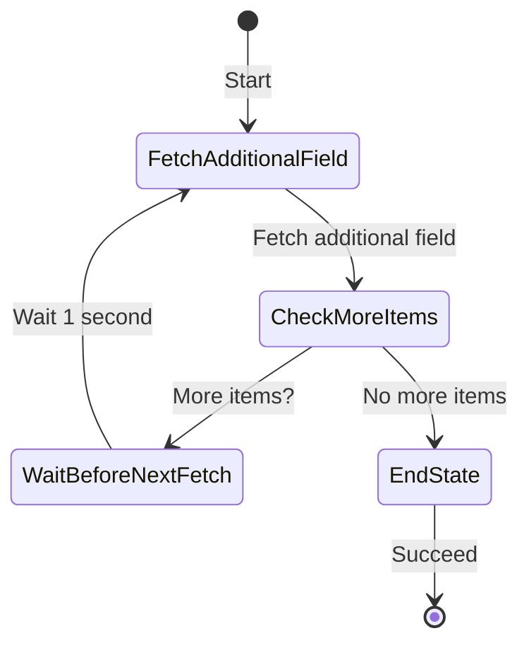

# sam nhs queries

This project demonstrates authenticating to the NHS content API and archiving data from it methodically to DynamoDB using Serverless Application Model (SAM) with Python. The API has a multi-stage authentication mechanism, is rate limited, and final-stage bearer tokens have a short lifetime. Data collection is in stages, using various techniques to accommodate all these requirements.

- [sam nhs queries](#sam-nhs-queries)
  - [Components](#components)
    - [GetAuth Function](#getauth-function)
    - [ListAllMedicines Function](#listallmedicines-function)
    - [FetchAdditionalField Lambda](#fetchadditionalfield-lambda)
    - [For all Lambdas](#for-all-lambdas)
    - [State Machine](#state-machine)
    - [DynamoDBTable](#dynamodbtable)
  - [Deployment/use](#deploymentuse)
    - [At NHS Digital onboarding:](#at-nhs-digital-onboarding)
    - [In AWS](#in-aws)
    - [At NHS Digital onboarding/Home/My applications and teams:](#at-nhs-digital-onboardinghomemy-applications-and-teams)
    - [In AWS](#in-aws-1)
  - [Warning](#warning)
  - [Cleanup](#cleanup)

## Components

### GetAuth Function

Sets up [authentication for API access to NHS digital 'NHS Web Content' API](https://digital.nhs.uk/services/care-identity-service/applications-and-services/cis2-authentication/guidance-for-developers/detailed-guidance/key-management). This Lambda creates a public/private RSA key pair, then calculates the modulus and exponent from the public key to create a matching JWKS (JSON Web Key Set). The private key is stored in Secrets Manager, and the public key and JWKS are stored in Parameter Store. The JWKS needs to be posted to NHS digital separately for use.

### ListAllMedicines Function

This Lambda uses an NHS Digital API key together with the RSA Private key and JWKS created by the GetAuth function to authenticate to the 'NHS web content API', get a JWT bearer token (valid for 5 minutes), and get a list of all the medicines described there. The API is rate-limited, and so we have exponential backoff to assist retries. At the time of writing, there are only 274 medicines listed, so this can be done reasonably with a single Lambda. The output is written to DynamoDB using the `URL` as the partition key and the `Name` as the sort key, e.g.:

```json
{
  "URL": {
    "S": "https://int.api.service.nhs.uk/nhs-website-content/medicines/aspirin-for-pain-relief/"
  },
  "Name": {
    "S": "Aspirin for pain relief"
  }
}
```

### FetchAdditionalField Lambda

This Lambda function is designed to fetch an additional field for each medicine from the NHS API and update the DynamoDB table with the retrieved information. It processes items in batches and ensures only one instance runs at a time using a Step Function.

**Available Fields**: You can configure the Lambda to fetch any additional field provided by the NHS API. Common fields include:
- `description` (default)
- `sideEffects`
- `warnings`
- `dosage`
- `contraindications`

**Configuration**:
- **AdditionalField**: This parameter allows you to specify which field to fetch for each medicine. Update the `AdditionalField` parameter in the `template.yaml` to select the field you want. But see [warning](#warning) below.

**Template Configuration**:
```yaml
Parameters:
  AdditionalField:
    Type: String
    Description: "The additional field to fetch for each medicine"
    Default: "description"
```

**Example Usage**:
- To change the field fetched by the Lambda, modify the `AdditionalField` parameter in the CloudFormation template to the desired field name (e.g., `sideEffects`).

**Batch Processing**:
- The Lambda function processes items in batches of 25 and uses DynamoDB pagination to handle large datasets efficiently. It accumulates up to 25 items that do not have the specified additional field and processes them in each iteration.

**Retry Logic**:
- The Lambda function includes retry logic to handle temporary API rate limits. It uses exponential backoff to retry requests if rate limits are hit.

**DynamoDB Update**:
- The Lambda function updates the DynamoDB table with the new field for each medicine entry, ensuring no duplicate work is done. Only items that do not already have the additional field populated are processed.

**Pagination Handling**:
- The function handles DynamoDB pagination by checking the `LastEvaluatedKey` and continuing to scan until it accumulates the required number of items or reaches the end of the table.

**Note**: Despite structuring of the table for better future access patterns and clarity, the `scan` operation is still used to find items without the specified additional field, as DynamoDB does not support using `query` for this purpose.

### For all Lambdas

For each Lambda, logs have a configurable Logger Level set based on an environment variable with a default to show only errors or warnings.

### State Machine

The state machine orchestrates the FetchAdditionalField Lambda function to ensure only one instance runs at a time. This helps in efficiently managing the processing of large datasets without overwhelming the system.

**State Machine Definition**:
- The state machine is defined in the CloudFormation template using the `AWS::StepFunctions::StateMachine` resource.
- The state machine starts with the `FetchAdditionalField` task, which invokes the FetchAdditionalField Lambda function.
- If there are more items to process (`moreItems` is true), the state machine waits for 1 second and then invokes the Lambda function again.
- The state machine exits when there are no more items to process.

**Diagram**



### DynamoDBTable

This is where we output our retrieved information.

## Deployment/use

### At [NHS Digital onboarding](https://onboarding.prod.api.platform.nhs.uk/):

1. Create NHS developer account.
2. Register your new application in environment 'Integration test'.
3. Ensure `Connected APIs' includes `NHS Website Content API (Integration Testing Environment)`.
4. Edit API - create and get 'key' (secret not needed).

### In AWS

5. Create API key secret (`API_KEY`:`<value_from_above>`) in AWS Secrets Manager and get ARN for SAM stack.

6. Deploy, with e.g.:

```bash
sam build && \
sam deploy \
    --stack-name NHSMedicines \
    --capabilities CAPABILITY_NAMED_IAM \
    --parameter-overrides $(jq -r 'to_entries | map("\(.key)=\(.value|tostring)") | .[]' vars.json) \
    --region eu-west-2 \
    --resolve-s3 
```

7. Trigger the 'GetAuth' Lambda function manually, e.g., in the Console with 'test'. This should populate the private key and SSM parameter public key and jwks. Normally you would only need to run this Lambda once.
8. Collect jwks from parameter store and save as, e.g., 'key.json' with e.g.

```bash
aws ssm get-parameter --name "/NHSMedicinesList/jwks" --query "Parameter.Value" --output text > jwks.json
```

### At NHS Digital onboarding/Home/My applications and teams:

9. 'Edit' Public key URL.
10. Upload 'key.json' created above and save.
11. Ensure the key is recognised as valid.

### In AWS

1.  Trigger `ListAllMedicinesFunction`, manually as for 'GetAuth' function above. Again, normally you would only need to run this Lambda once.
2.  Review DynamoDB table.
3.  Start the state machine execution, e.g. from the AWS Step Functions console, to begin processing the items in DynamoDB. The state machine will ensure that only one instance of the FetchAdditionalField Lambda function runs at a time, processing the items in batches.
4.  Review DynamoDB table.

## Warning

Be aware that due to [this open issue with SAM](https://github.com/aws/aws-sam-cli/issues/4404) updating parameters on a deployed stack may not be recognised. If your changes don't appear to make a difference, then you may need to verify these are correct in AWS manually.

## Cleanup

By default, directly deployed resources, such as the DynamoDB table, are deleted on stack deletion. While this is suitable for PoC work, it may not be suitable for your use case.

```bash
sam delete \
    --stack-name NHSMedicines \
    --region eu-west-2
```

Delete your log groups.

You will need to suspend versioning in your SAM S3 bucket if you opted to have this managed for you before you can truly empty and delete it.